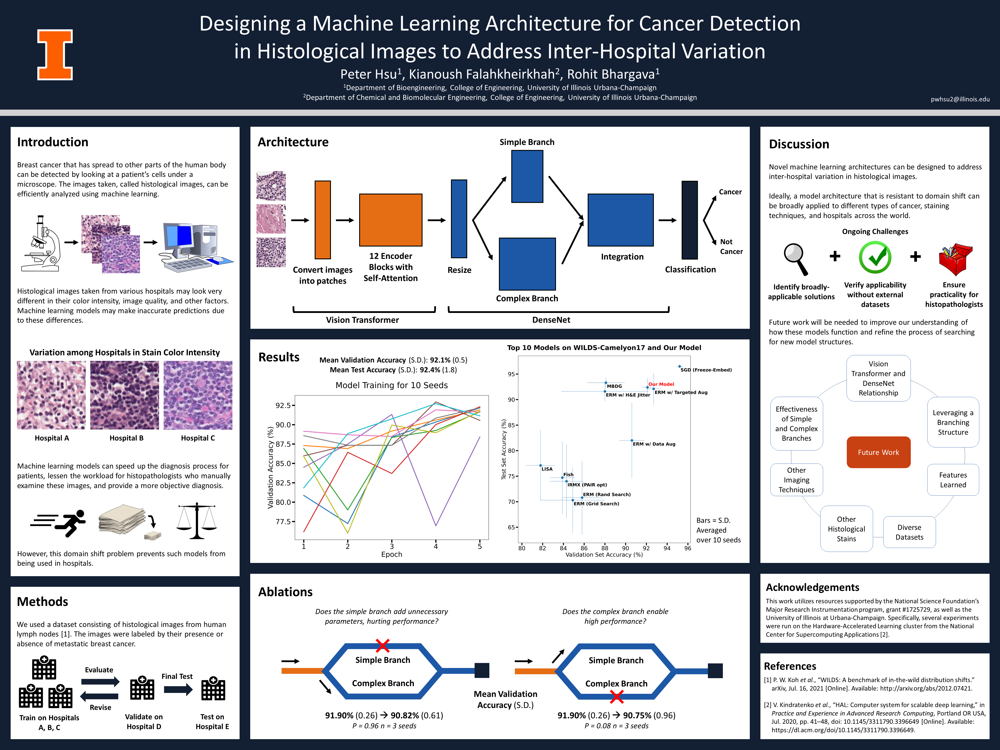

# Combined ViT-DenseNet



## Dataset

The dataset used was curated by WILDS from Stanford University.  Details on how to install the WILDS package can be found [here](https://wilds.stanford.edu/get_started/).

I used the [Camelyon17 dataset](https://wilds.stanford.edu/datasets/#camelyon17) from WILDS, which is a modified version of the [original Camelyon17 challenge](https://doi.org/10.1109/TMI.2018.2867350).

## Architecture

This architecture is a combination of a Vision Transformer and DenseNet.
1. Input image patches are given to a 12-encoder layer Vision Transformer.
2. The output is reshaped in the first transition layer.
3. The output is given to two branches, which are DenseNets.  The first branch (complex) consists of more Dense layers compared to the second branch (simple).
4. The outputs from both branches are concatenated.
5. The concatenated output is given to a second transition layer, which is a DenseNet transition layer.
6. The output is given to a final DenseNet.
7. Binary classification is performed using a linear layer and Softmax.

## Running Code

This project was run on a cluster that utilized a modified version of SLURM.  Packages were provided through OpenCE 1.7.2.

```
#!/bin/bash
#SBATCH --job-name="project"
#SBATCH --output="project.%j.out"
#SBATCH --error="project.%j.err"
#SBATCH --partition=gpux1
#SBATCH --time=24

module load opence/1.7.2
python3 -m pip install wilds
python3 model.py
```

## Results

[Validation Results (PDF)](val_results.pdf) | [Test Results (PDF)](test_results.pdf)

10 seeds were used.  For each seed, the model parameters that resulted in the highest validation accuracy in an epoch were used for the test set.  The test set was used only once and no modifications to the model were made thereafter.

## Acknowledgements
This work utilizes resources supported by the National Science Foundation’s Major Research Instrumentation program, grant #1725729, as well as the University of Illinois at Urbana-Champaign.

## References
[1] P. W. Koh et al., “WILDS: A Benchmark of in-the-Wild Distribution Shifts.” arXiv, Jul. 16, 2021. doi: 10.48550/arXiv.2012.07421.

[2] P. Bandi et al., “From Detection of Individual Metastases to Classification of Lymph Node Status at the Patient Level: The CAMELYON17 Challenge,” IEEE Trans. Med. Imaging, vol. 38, no. 2, pp. 550–560, Feb. 2019, doi: 10.1109/TMI.2018.2867350.

[3] V. Kindratenko et al., “HAL: Computer System for Scalable Deep Learning,” in Practice and Experience in Advanced Research Computing, Portland OR USA: ACM, Jul. 2020, pp. 41–48. doi: 10.1145/3311790.3396649.